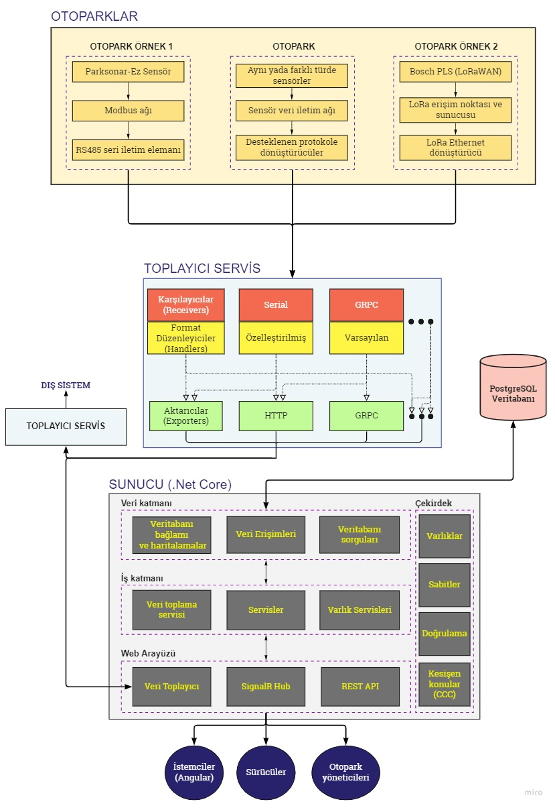
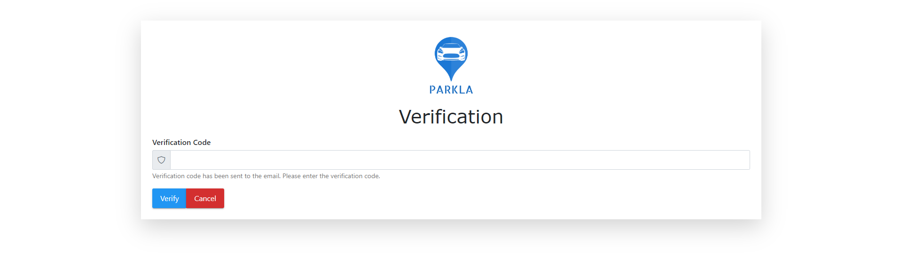
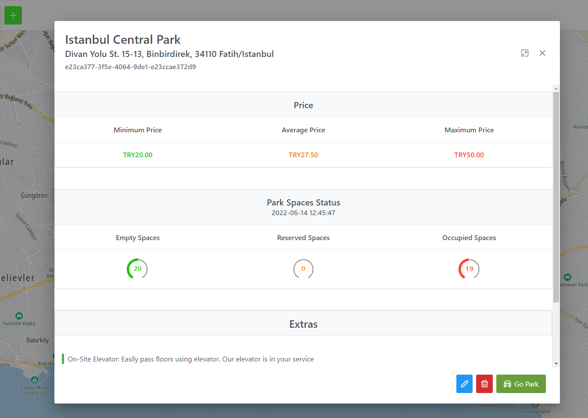
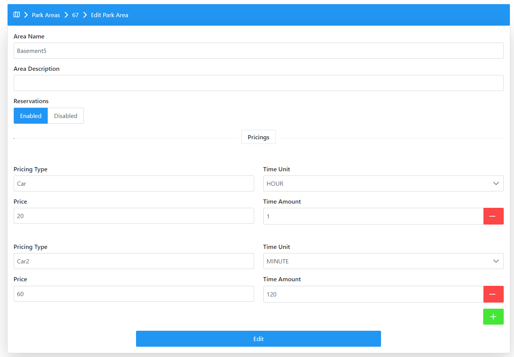
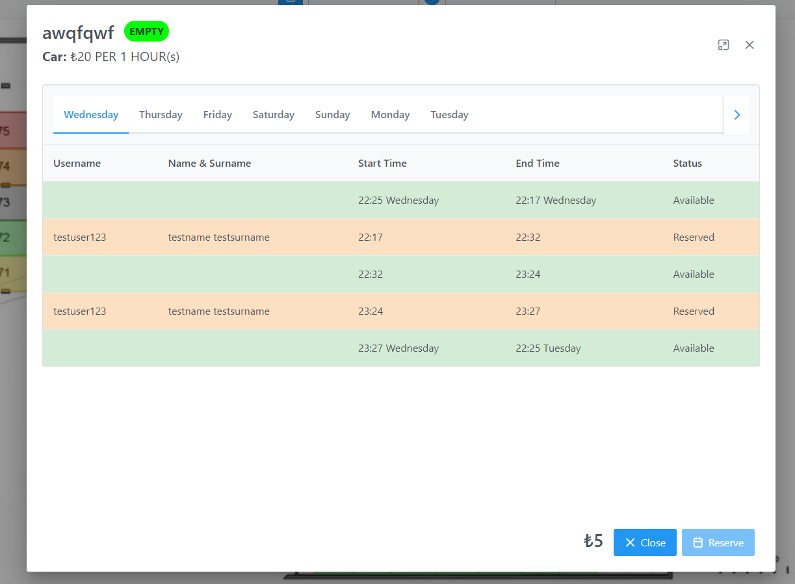
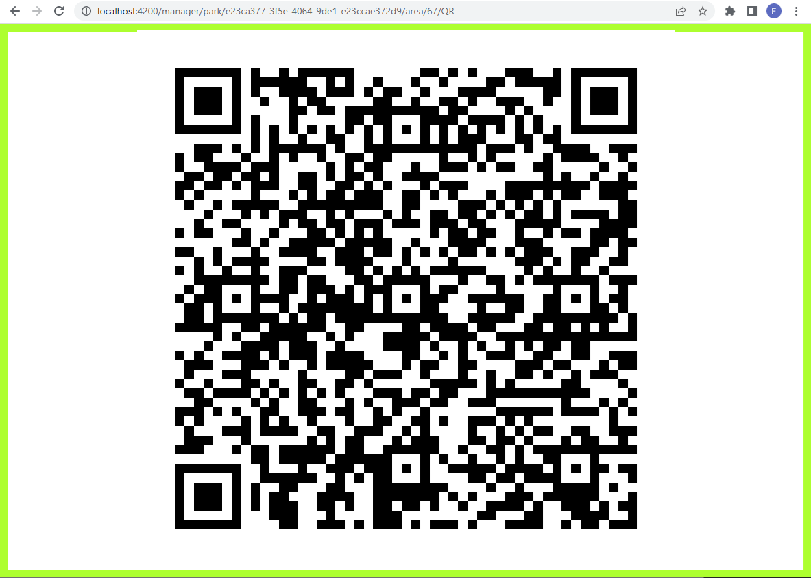

# PROJECT
* Project Name: <br/>
Parkla

* Project Team: <br/>
Fadıl Şahin

* Project Start Date: <br/>
February, 2022

* Project State And Duration: <br/>
Finished, 4 Months

* Project Description: <br/>
This repository is a completed graduation project in a project management aspect with a limited time and cost, defined scope and targeted quality about parking lot management and monitoring in real time. This software is designed to show all parking lots on a map with a real time status information, get data from any parking lot that support same protocols with the web application and collector service (easily extensible if any protocol is needed and status message format is customizable using a plugin code file named 'Handler'), show exact parking lot status on a 2D image model like blueprint of the building with multiple areas have a lot of parking space inside using that data, show status of all parking spaces and make them reservable for users (drivers, passengers, ...) using a reprensentetive payment page and user wallet, make parking lots managable by a parking lot manager like adding, deleting, updating parks, parking areas, parking spaces, binding real parkig spaces of their parks to parking space models that user can see in the screen and reserve. Details, explanations, how to setup and execute the application, images of working application etc. are below.


Used Technologies, Protocols, Libraries, Concepts etc: <br/>
ASP.NET Core 6, Angular 13, PrimeNG, HTTP, GRPC, SERIALCOM(RS-232), SignalR, websocket, PostgreSQL 13, Entityframework, optimistic concurrency, asynchronous programming, configuration management, authentication, BCrypt password hashing salting peppering, JWT bearer tokens, sliding expiration refresh token, automapper, N-Tier architecture, Plugin architecture, MVC, Razor, SMTP, middleware, expression tree, fluent validation, tomtom web sdk, d3-zoom, sass, ngrx, interceptor, guard 
<br/>
<br/>

- [PROJECT](#project)
- [SETUP AND RUN](#setup-and-run)
  - [Web Server and Client](#web-server-and-client)
  - [Collector Service](#collector-service)
  - [Park Simulator](#park-simulator)
- [FINAL PRODUCT AND FEATURES](#final-product-and-features)
  - [Client and Functionalities](#client-and-functionalities)
    - [Parking Lot Simulation](#parking-lot-simulation)
    - [Registeration and Authentication](#registeration-and-authentication)
    - [User and Manager Mode](#user-and-manager-mode)
    - [TomTom Maps and Car Parks](#tomtom-maps-and-car-parks)
    - [Parking Lots](#parking-lots)
    - [Parking Areas](#parking-areas)
    - [Parking Spaces and Reservation Management](#parking-spaces-and-reservation-management)
    - [QR Code Access](#qr-code-access)
    - [Manager Dashboard](#manager-dashboard)
  - [Web Server](#web-server)
  - [Collector Service](#collector-service-1)
    - [Receiver Config](#receiver-config)
    - [Exporter Config](#exporter-config)
    - [Handlers and Customization](#handlers-and-customization)
- [LITERATURE RESEARCH AND ANALYSIS](#literature-research-and-analysis)
  - [Parking Problems](#parking-problems)
  - [Parking Lot Management](#parking-lot-management)
  - [Car Parking Systems](#car-parking-systems)
    - [Multilevel Car Parking System](#multilevel-car-parking-system)
    - [Full or Pratially Automated Car Parking System](#full-or-pratially-automated-car-parking-system)
    - [Smart Car Parking Systems](#smart-car-parking-systems)
      - [Variable Message Sign (VMS) System](#variable-message-sign-vms-system)
      - [Wireless Sensor Based System](#wireless-sensor-based-system)
      - [RFID Based System](#rfid-based-system)
      - [QR Code Based System](#qr-code-based-system)
      - [Image Processing Based System](#image-processing-based-system)
      - [E-Park System](#e-park-system)

# SETUP AND RUN
1. [Install](https://www.postgresql.org/download/) PostgreSQL database (v13 used)
2. [Install](https://dotnet.microsoft.com/en-us/download/dotnet/6.0) .Net core 6 sdk
3. [Install](https://nodejs.org/en/download/) NODE and NPM (v16.13.2 used)
   
## Web Server and Client

Make a secret.json file inside [src/Parkla.web](src/Parkla.Web/) like [Example Secret Settings](src/Parkla.Web/secret-example.json). An outlook email and password is necessary to make the app working without error and not being crashed. Other ones are used for password hashing and peppering.

Set TomTom Map api key in [private.ts](src/Parkla.Web/ClientApp/src/app/core/constants/private.ts) which you will get after directions in https://developer.tomtom.com/how-to-get-tomtom-api-key. For your sake, the key already exists as freemium in the file.

Initiate a PostgreSQL v13 database named 'parkla' and a user with username 'postgres' and password '123' has all privileges like ddl and dcl below. Import [parkla-backup](parkla-backup) to the database (If you want an empty database, migrations at [src/Parkla.DataAccess/Migrations/](src/Parkla.DataAccess/Migrations/) can be used with [ef cli tool](https://learn.microsoft.com/en-us/ef/core/cli/dotnet) using `'dotnet ef database update'` command after changing directory to [src/Parkla.DataAccess](src/Parkla.DataAccess/)).

```sql
CREATE USER parklauser WITH ENCRYPTED PASSWORD '123'
GRANT all privileges ON DATABASE parkla TO parklauser
GRANT all privileges ON ALL TABLES IN SCHEMA public to parklauser
```

Set "Parkla-admin" connection string in [appsettings.json](src/Parkla.Web/appsettings.json) according to postgresql server host, port, database name and new user's username and password. (By default it is compatible previous steps). Also set serialPortName config to receive park status data from that serial port.

Build web server using cli command `"dotnet build"` in [src/Parkla.Web/](src/Parkla.Web/) directory then run with `"dotnet run"`. When SPA proxy is ready, start a client with opening https://localhost:7070/ on a browser. It will open an angular development server and redirect to angular SPA client automatically.

For dotnet development certification problems https://learn.microsoft.com/en-us/dotnet/core/tools/dotnet-dev-certs.

## Collector Service

Configure the service's [appsettings.json](src/Parkla.CollectorService/appsettings.json) file sections that are pluginLibrary to add custom handlers and pipelines has receivers, handlers and exporters (By default it is configured). Detailed informations are in [Collector Service Chapter](#collector-service).

Build collector service using cli command `"dotnet build"` in [src/Parkla.CollectorService](src/Parkla.CollectorService/) directory then run with `"dotnet run"`. Collector service has no ui.

## Park Simulator

Configure the simulator's [appsettings.json](src/Parkla.ParkSimulator/appsettings.json) file RealSpace section has realspace id and names according to web application parking space models.

Build simulator using cli command `"dotnet build"` in [src/Parkla.ParkSimulator](src/Parkla.ParkSimulator/) directory then run with "dotnet run". Open simulator ui on a browser with url https://localhost:7072.

# FINAL PRODUCT AND FEATURES



Designed system consists of different components which are parking lots, collector service, web server, database, clients. Parking lots are not modelled as a software component and referred to the real ones. Parking lots produce real parking space status information (occupied, empty or unknown) and transfer these data to the web server directly or via collector service. These data are produced independent to the software system and involved by software system after received the data. So, the software system has a kind of ETL (Extract Transform Load) part to get data, convert it to acceptable vendor agnostic model and save to the database. At this point, parking lot executives provide the necessary infrastructure, sensors, and internal network. A lot of parking lots already has this kind of structure. For example, a parking lot can produce variable format of parking space data with Parksonar-Ez, Bosch PLS or other type of sensors. All this data can be transfered by internal network uses different kind of protocols like modbus and LoRaWAN to the network components. Some kind of network components like LoRa ethernet converter, RS485, embedded or high level softwares can produce http message can send the data to the designed software system in a supported or customized data format using supported protocols like HTTP, GRPC, SERIALCOM. When web server gets the parking space status data, It is possible to use this data and making real time car park, parking area, parking space modellings, reservations, generating analytical data etc. Software system is designed as easily extensible in terms of protocols. This means the system can be integrated with a lot of parking lots in time.

## Client and Functionalities

Clients (drivers, parking lot managers, passangers etc.) communicate with web server is built using Angular and runs as a SPA on browser. A client can fetch application data using REST API, realtime data by subscribing appropriate SignalR hubs until connection lost or unsubscription. With all these data, provides graphical user interface in web pages for car parks on TomTom Map which are shown as a pinned boxes has park name, location, total occupied, empty, reserved, occupied parking space count inside and shown in a modal dialog contains other data like min average and max pricing per hour information opened after clicking the boxes, parking areas has same information of car parks in a parking area scope and other parking area data, parking spaces in a real parking area building structure image modelled with rectangles colored with green, red, orange, gray and transition colors close to these according to status and reservation information, dashboard has graphics and tables about analytical data.

### Parking Lot Simulation


Data flow is necessary to see the parking space status changes from parking lots to the client UI in real time. The system does not work integrated with any real parking lot. To see the data flow working, a simulator project was built. Normally, in integrated working system, parking lots generates park space status data. This data is sent to a collector service from a parking lot. Collector service receives the data and sends it to the web server. Then the server sends the status data to the client using SignalR and persist it to the database. In this scenario, parking lot and parking space status data generation are missing pieces. As it is said, The simulator project undertakes the duty. Fake real spaces can be configured with filling [appsettings.json](src/Parkla.ParkSimulator/appsettings.json) file as example it includes. This real space ids should match the real space ids which are different from client side parking space ids. These real spaces are in a table which is inside the parking space editing modal as it is mentioned in [Parking Areas](#parking-areas) section. Also parking lot GUID type id, collector service http endpoint and serial port are needed by the simulator. Configuration of the environment in te gif above already exists in this file. Simulator sends status data to the collector randomly after starting. Using protocol can be change and it is possible to change the parking space status data manually by clicking rectangles on the browser.

### Registeration and Authentication

User registeration page is like image below. A user has username, e-mail, password, name, surname, phone number, gender, birthday, city, district, address information and all these are taken from the form below.


After clicking register and ui validation, new user is added to the database by server. Password column of user table in the database, is hashed by bcrypt algorithm and salting and peppering is used. User activation is necessary before login. So, activation code is sent to the new user's mailbox. While logging in, it will be asked. Login and verification page is like below.




After verification and login process, server generates a auth and refresh JWT Bearer token and sends to the ui. User agent stores it to the local storage. Auth tokens has an absolute expiration time but for refresh token sliding expiration method is used. When tokens are expired, user logs out. After logout, these tokens are removed from local storage.

### User and Manager Mode

Registered users can use the UI in 2 modes that are user and manager mode.
In user mode, park space status displaying in parking lots in real time and reservation of them can be done. In manager mode, adding, deleting and updating parking lots, areas, spaces, real parking space and application parking space mappings can be done. Also the user can view the analytical dasboard of his/her parking lots.

### TomTom Maps and Car Parks


On the client side, TomTom Maps web sdk is used. Because of that an api token is necessary as mentioned in the setup section before. Basic map movement, zoom in & out, pan, PoI (Point of Interest) search functionalities are added. Using web sdk marker functionality, parking lots are symbolized as markers which have address, last update time, min & avg & max pricings per hour and empty, occupied, reserved park space count of a parking lot according to latitude and longitude information. All parking lot CRUD operations and park space status changes can be seen without refreshing the page. After logging in, this map page opens as above in image.

### Parking Lots


After clicking one of the parking lots in the map, detailed information modal opens as below.



Blue button with pencil icon to edit and red button with trash icon to remove the parking lot are for only manager mode. In manager mode, only the logged in user's own parks can be seen, for user mode, all parking lots created before are shown in the map. Green button with plus icon at the left top corner of the page also can be seen in manager mode to add a parking lot. Editing and adding parking lot page is like below.


Maximum extra line count is 10. Green plus button can be used to add and red minus button to remove extras. Blue button with marker icon in latitude & longitude section can be used to select location in the map like below.


### Parking Areas


After clicking the go park button in a parking lot modal, parking areas can be seen as a searchable, paginatable, orderable tabular or grid view in a table.


Multiple parking areas can be in a parking lot. For example, Floors of multi level car park or multiple streets of street car park can be seperated as areas. Again empty, occupied, reserved park space count, min avg max pricing per hour, last update time of a parking area is shown in realtime. Buttons for add, edit, delete parking area are only for manager mode and all changes for areas can be seen without refreshing the page. After clicking add or edit buttons, the page below opens.



For an area pricing types can vary. Multiple pricings can be defined like above.

### Parking Spaces and Reservation Management


Multiple parking spaces are shown as located in an image of a parking area. This image can be real blueprint, sketch, plan or anything else that symbolizes actual parking area. This image can be uploaded in manager mode for a parking area. In this image, parking spaces can be drawn as rectangles. Zooming and panning is possible for the image and it is like below.


Park spaces are shown with different colors. For the park space, red means occupied and a reservation interception does not exist for selected date range, green means empty and not reserved, orange means occupied also reserved and yellow means empty also reserved at the same time with the time user looks to the image exactly. A reservation can be done for any time between the users' datetime and relatively 1 week later. All reservation table can be seen after clicking one of the park spaces like image below.



Reserved time intervals and user's username, name and surname who reserved can be seen in this table. If any reservation do not exist in a day, there is a single row that shows available time interval from what datetime to another datetime for other days. If a reservation exists, then this single row divided and is shown as a first and last row. At the top of the dialog, there is space name, status and pricing information. At the bottom of the dialog, there is actual price for selected date range of the space. Payment can be done if the user has enough money in his/her digital wallet which can be loaded before reservation.

parking area image loading and defining park spaces in this image can be done in manager mode. In this mode, header bar is like below.


Button with barcode icon is explained in [QR Code Access](#qr-code-access) section but button with pencil icon is again for editing the parking area image and parking spaces. After clicking that, the page below opens.


In this page new parking spaces can be added, existing ones can be updated or deleted and new parking area image can be set. In the image, already there is an image and parking spaces drawn. New image can be set with yellow button with image icon at right bottom corner. After that the image should be selected from the device. New spaces can be added using the green plus button next to the image button. After clicking this button, it switches the red cross button to cancel parking space area selection. At this selection mode, 4 corners of the parking space can be selected by clicking the image in order. Red button with trash icon can be used to remove all added parking spaces in the image. To delete one by one, parking spaces can be right clicked. After adding parking spaces, they should be configured correctly. To open configuration modal, parking spaces can be left clicked and then the modal below opens.


In this modal, space name, pricing type inputs should be filled and one of the real spaces should be selected. If these are missing, the validation fails and invalidated parking spaces are colored as light red like edit page above else they are colored as gray. If an invalid space exists, saving the changes give an error. Real spaces can be added in this modal also using textbox and add button below. Real space rows already selected are colored as light green or not colored but has space id values and cant be selected for current parking space. If it is colored, it means the real space is selected by this parking area. Otherwise if it is not colored and has space id column value, it means the real space is selected by another parking area. Real space id values are used to match the parking space in the image with actual parking space status data. Also they can be removed by using red cross buttons at the end of the rows.

### QR Code Access

To make the system more accessible, QR code of the parking area direct access link can be shared for users in a big board, to one side of a building, on a screen of small electronical devices etc. close to the parking areas. Users can easily open the area page after scanning the shared qr code. 


After clicking the button with QR code icon in parking area page in manager mode, QR Code relative to screen sizze and containing the url of that area page is generated on a browser page like below.



### Manager Dashboard

Gathered data from real parking lots are saved to the database by server. These data also can be used to generate an analytical data. A dashboard page exists for manager mode users to analyze their parking lots. In this dasboard, there are graphically shown current empty, occupied, unknown parking space count, revenue day by day, min avg max parking space using time, car count that used parking spaces for last month and other things.


## Web Server

Web server is a bridge between clients, realtime parking space status data and persisted storage data in the database. Server is a backend built on N-Layered architecture. It has a web API layer to communicate with collector service, clients and external system produces parking space status data.The API has seperate receivers for each protocol to receive supported protocols, SignalR hubs perform realtime data flow, REST API to access database storage. This web api layer has a dependency to the business layer contains internal logic, validations, data layer calls. Business layer has a dependency to the data layer contains ORM framework spesific implementations, database query and access functionalities, database table mapping configurations and migrations. Core layer communicates with all other layers and contains orm entity definitions, constants and other type of cross cutting concerns. Clients can authenticate, register, perform CRUD operations for car parks, parking areas, parking spaces, reservations.

## Collector Service

Collector service communicates with supported protocols. It is designed as a seperate executable application and capable to receive data come from car parks using receivers, reformat the data using handlers and transfer them using exporters. Collector service can be run on existing machines, servers, devices in parking lot building, buildings close that or other locations. Mulitple service can be configured to communicate together. In this way, very flexible(customizable format data, protocol independent), efficient(prevents transforming unnecessary data) and distributed communication structure can be set up. It is also possible not to use a collector service and transfer the correctly formatted data to the server. The difference using collector service is that the service can listen on multiple endpoints, groups, ports using multiple protocols with the capability of receiving custom formatted data but the server can listen on a single constant endpoint with single format. Custom format data support provides an advantage of increasing the integrated car park count to the software system by not forcing them to provide exact data and change their infrastructure. All data flow can be defined as pipelines. Each pipeline has a collection of receiver handler pair and exporters. Data comes to receivers, receivers give the data to its handlers, handlers deserialize the data in a format and load it to the memory as a park space status class instance and pass the data to the all exporters in the pipeline, exporters serialize the status data instance and send to other applications' protocol dependent endpoints in JSON format. Handlers also read data as JSON by default because custom format data can be received once after they are produced by a parking lot. After that the data will be vendor agnostic and simplified. Each pipeline flow is carried asynchronously not to block other flows. To make a custom handler, [src/Parkla.CollectorService.Library](src//Parkla.CollectorService.Library/) plugin project can be used. After coding a new handler and building the project, generated dll file path has to be referred by pluginLibrary section in collector service configuration file. Example configuration of pipelines and plugin library is in [appsettings.json](src/Parkla.CollectorService/appsettings.json) file.

### Receiver Config

All receivers have a type value to select protocol will be used to receive and a handler to convert incoming data which is formatted json by default or customized to [ParkSpaceStatus data transfer object](src/Parkla.Core/DTOs/ParkSpaceStatusDto.cs). According to type value, other protocol specific fields can be configured.

HTTP RECEIVER:
```json
{"type": "http",
"endpoint": "/example/endpoint",
"handler": "default"}
```
Endpoint can be used to multiplex http requests for a running collector service in a machine has single ip and port with respect to path of the request urls.

SERIAL RECEIVER:
```json
{"type": "Serial",
"portName": "COM2",
"handler": "ExampleHandler"}
```
Port name can be used to multiplex pyhsical data ports of a machine that runs collector service for serial communication.

GRPC RECEIVER:
```json
{"type": "gRPC",
"group": "testgroup",
"handler": "GrpcHandler"}
```
Grpc protocol defines proto files as a communication specification between a client and server. So that, a [collector.proto](src/Parkla.Core/Protos/collector.proto) file is defined and data sent for each remote call are multiplexed by group field on application level instead of using multiple grpc channels.

### Exporter Config

All exporters also have a type value to select protocol will be used to export but dont have a handler value because format normalization should be at once in a complete data transfer flow. According to type value, other protocol specific fields can be configured.

HTTP EXPORTER:
```json
{"type": "HTTP",
"url": "https://localhost:7071/external/endpoint"}
```
Url can be used to select a running collector service or web server instance on a machine with respect to machine domain and ip, the service or server port and multiplexing endpoint and protocol schema.

SERIAL EXPORTER
```json
{"type": "Serial",
"portName": "COM1"}
```
Port name can be used to select a physical serial port wired to the port of running collector service or web server receiving port.

```json
{"type": "GRPC",
"group": "testgroup",
"address": "https://localhost:7071"}
```
Address can be used to select the runnig collector service or web server on a machine with respect to machine domain and ip, the service or server port and protocol schema.

Group can be used to select multiplexing group of receiving collector service or web server.

### Handlers and Customization

handler values in receivers are "default" by default. For each receiver protocol a default handler is defined as in [src/Parkla.CollectorService/Handlers/](src/Parkla.CollectorService/Handlers/) folder. Default park space status data format is like below.

```json
{"ParkId": "22afa9d4-d154-2734-bf02-ab3cde33fgh7",
"SpaceId": 2412,
"Status": "OCCUPIED",
"DateTime": "2022-05-24T14:51:14Z+3:00"}
```

Park id is GUID type and indicates a real parking lot has the real park space inside. This id is given by web server after creation of a parking lot in ui by a manager user.

Space id is unique integer type in a parking lot system and indicates a real park space.

Status is enumeration type which can be "OCCUPIED", "EMPTY" and "UNKNOWN".

Datetime is exact date of creation of the status data.

To handle different format of status data, a plugin can be added to a collector service using [src/Parkla.CollectorService.Library](src//Parkla.CollectorService.Library/) project. In this project, a new handler can be coded by using [HandlerBase](src/Parkla.CollectorService.Library/Bases/HandlerBase.cs) class, [Type]ReceiverParam classes in [src/Parkla.CollectorService.Library/HandlerParameters/](src/Parkla.CollectorService.Library/HandlerParameters/), [ReceiverType](src/Parkla.CollectorService.Library/Enums/ReceiverType.cs) enum and [ExporterType](src/Parkla.CollectorService.Library/Enums/ExporterType.cs) enum declarations.

Handler base abstract class has virtual Handle and HandleAsync methods and provides the facility of implementing these in a derived class according to synchronous or asynchronous operations in new handler. These implementations are protocol specific. So protocol type and protocol parameters are needed. These data are passed as Handle method parameters. After implementation of a new child class of HandlerBase, plugin library should be built and generated dll should be referred as relative or absolute path at `pluginLibrary` section in the config file. After that, class name of the new handler can be given as a value to receiver handler configuration section.

# LITERATURE RESEARCH AND ANALYSIS

## Parking Problems

## Parking Lot Management

## Car Parking Systems

### Multilevel Car Parking System

### Full or Pratially Automated Car Parking System

### Smart Car Parking Systems

#### Variable Message Sign (VMS) System

#### Wireless Sensor Based System

#### RFID Based System

#### QR Code Based System

#### Image Processing Based System

#### E-Park System